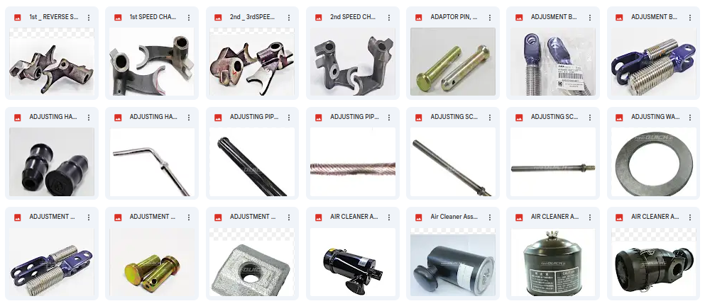

## Project Summary
Project Name : **Image Search Engine Toko Quick**
<br>
<br>
Algoritma Pendekatan : 
<br> 

* Pre-trained Keras [VGG19](https://keras.io/api/applications/vgg/#vgg19-function) for **feature extraction**, [reference](https://arxiv.org/abs/1409.1556).
* Pre-Trained Keras [ResNet50V2](https://keras.io/api/applications/resnet/#resnet50v2-function) for **feature extraction**, [reference](https://arxiv.org/abs/1409.1556).
* CBIR - Content-Based Image Retrieval, see [wikipedia](https://en.wikipedia.org/wiki/Content-based_image_retrieval).
* K-Nearest Neighbour [(KNN)]( https://github.com/ultralytics/yolov5), see [wikipedia](https://en.wikipedia.org/wiki/K-nearest_neighbors_algorithm).


<br>

## Quickstart
Clone this repository, then install a`requirements.txt`.
```bash
$ git clone https://github.com/akbarwijayaa/image-search-tokoquick.git
$ cd image-search-tokoquick
$ pip install -r requirements.txt       #install
```
<br>

## Dataset
This project work uses a collection of product images, taken from the quick store website with scraping techniques. Of course, the dataset that will be used has been cleaned from noise images.




<br>


## Train & Test 
### Extracting Features & Similarity Measurement
The main process in image retrieval is the process of extracting image features and calculating the distance between features. Both of these processes are handled by `class features_extraction:` contained in the file `main.py`.
```python

class features_extraction:
    def __init__(self):
        pass
    
    def get_product_id(self, data_path, product):
        ...
        return result

    def get_prediction(self, query_image, model, feature_list, filenames, preprocess_input):
        ...
        return df

```

<br>

## Model Optimation 
### Change Feature Extractor Model Configuration
check file configuration in `/utils/config.ini` . everyone can change the value.

```php
[model]
architecture = resnet50v2        # resnet50v2/vgg19
weights = imagenet
feature_list = features.pkl
filenames = filenames.pkl

[knn]
algorithm = brute
metric = cosine      # cosine/euclidean

[flask_api]
secret_key = tkquick_image_search
debug = False
session_type = filesystem
session_file_dir = temp
```

<br>

## Image Search Engine API

## <div align="left">Endpoints</div>

- ###  Get API Info
    This endpoint is used for get information from api.
    <br>

    **Endpoint**
    ```bash
    GET   /predict
    ```

    **Response**
    ```
    API Image Search Tokoquick
    ```
    <br>

- ### Image Search Engine
    This endpoint is used for query by image. client have to send image to the api, and api automatically return product id recomendation based on picture their send.
    <br>

    **Endpoint**
    ```bash
    POST   /predict
    ```
    **Request Body** `(form-data)` :
    * **`image`** _(files, required)_ : image file as a query

    **Example Response**
    ```json
    {
    {
        "preds": [
            {
                "id_product": 6145,
                "product_name": "Wipro Bor Listrik SDS W6261 26mm",
                "score": 98.39
            },
            {
                "id_product": 6144,
                "product_name": "Wipro Bor Listrik SDS W6240 24mm",
                "score": 77.91
            },
            {
                "id_product": 6143,
                "product_name": "Wipro Bor Listrik Impact W6137 13mm",
                "score": 77.86
            },

            ...
            
        ],
        "success": true,
        "time": 0.67
    }
    }
    ```
    <br>

## <div align="left">Error Handling</div>
Image search tokoquick api using standard http status code as indication for success or fail response.

* **200** _OK_

* **400** _bad request_

* **403** _forbidden_

* **404** _notfound_

* **405** _method not allowed_

* **408** _request timeout_

* **500** _internal server error_

* **502** _bad gateway_

* **503** _service unavailable_

* **504** _gateway timeout_
